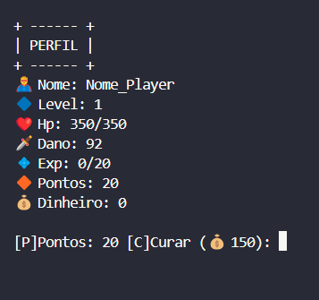
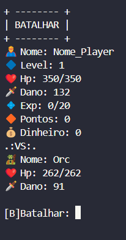
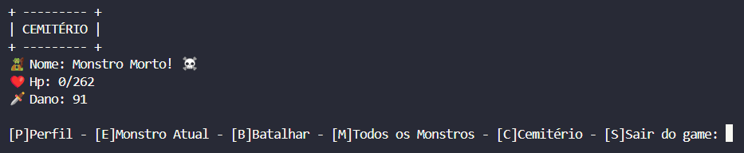

# RPG de terminal

> Esse é um RPG de terminal, um projeto simples criado para fixar o aprendizado do curso do professor [Luiz Otávio Miranda](https://www.udemy.com/course/python-3-do-zero-ao-avancado/?couponCode=KEEPLEARNING)

O projeto ainda está finalizado:

- [x] Perfil
- [x] Monstro Atual
- [x] Batalhar
- [x] Todos os Monstros
- [x] Cemitério
- [x] Sair do Game

## 🚀 Para jogar o RPG de Terminal

Para jogar o RPG de Terminal, basta copiar o codigo do arquivo [Jogo](JOGO.py)

É um projeto de jogo simples, onde cria um personagem com status aleatorios, e monstros com status aleatorios. Onde os dois batalham com um sistema de pedra, papel e tesoura.

## 🖼️ Prints do projeto
### Perfil

### Adicionando pontos

### Monstro atual

### Batalhar

### Como Batalhar

### Cemitério

